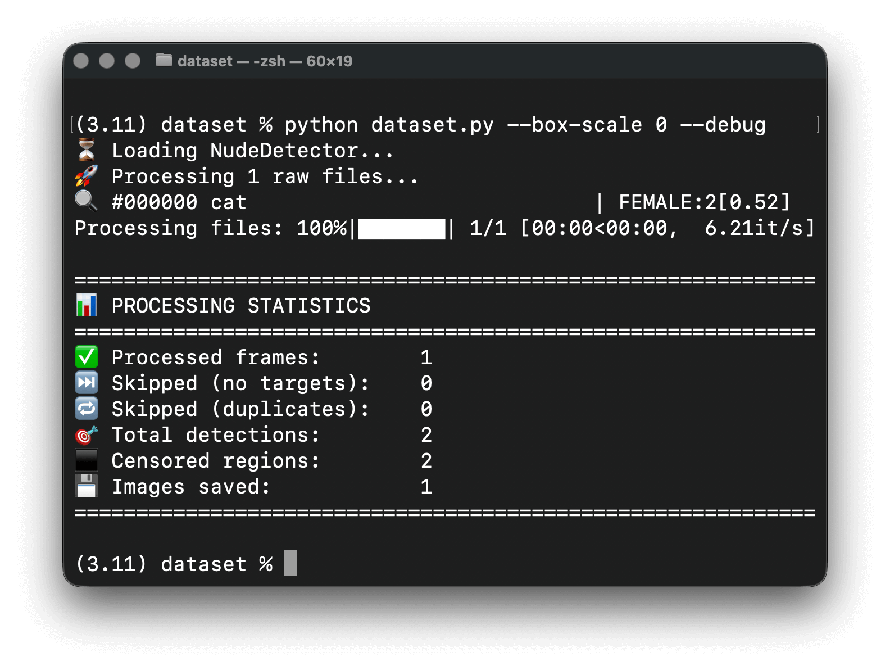
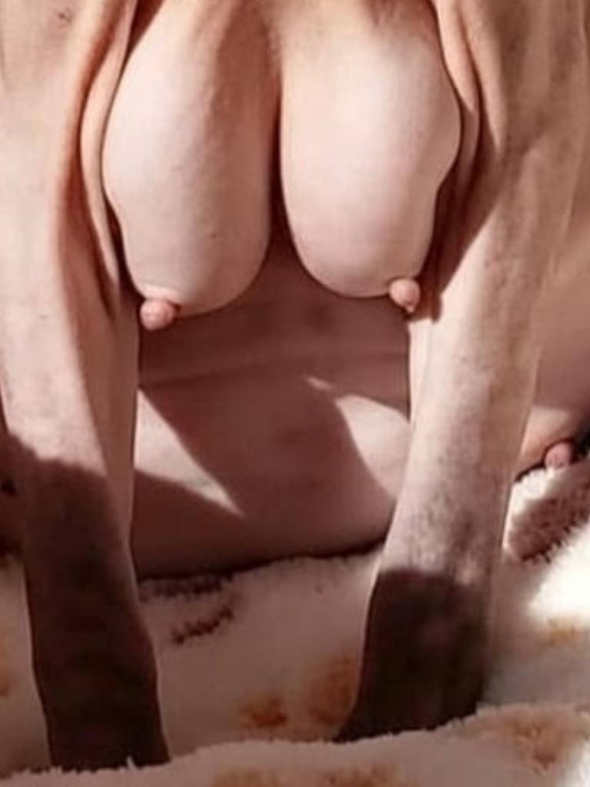
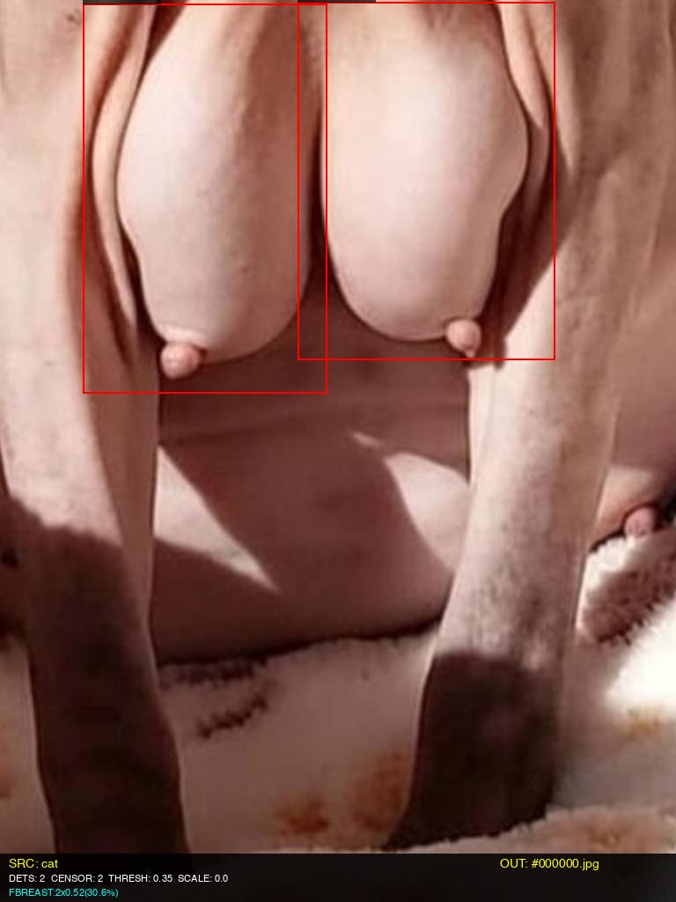

# 🎯 Ultimate Intelligent Dataset Generator

[](https://www.python.org/downloads/)
[](LICENSE)
[](https://github.com/psf/black)

Advanced AI-powered dataset creation tool with intelligent frame extraction, perceptual deduplication, and smart captioning for training computer vision models. Automatically processes images, videos, and GIFs while applying censorship and generating natural language descriptions.



---

## 📑 Table of Contents

- [Key Features](#-key-features)
- [Prerequisites](#-prerequisites)
- [Installation](#-installation)
- [Quick Start](#-quick-start)
- [Usage Examples](#-usage-examples)
- [Parameters](#-parameters)
- [Output Structure](#-output-structure)
- [Performance](#-performance-example)
- [Caption Examples](#-caption-examples)
- [Troubleshooting](#-troubleshooting)
- [Known Issues](#-known-issues)
- [FAQ](#-faq)
- [Ethical Usage](#-ethical-usage)

---

## ✨ Key Features

### 🧠 Intelligent Processing

- **Perceptual Hashing**: Uses dHash algorithm for frame-level deduplication, preventing identical frames from overloading your dataset
- **Smart People Detection**: Accurately counts subjects without creating "phantom people" from spatial analysis
- **Adaptive Frame Extraction**: Automatically samples unique frames from videos/GIFs based on visual similarity
- **NudeNet Integration**: High-accuracy body part detection with configurable confidence thresholds

### 📝 Advanced Captioning

- **Two-Tier Captioning System**:
  - **Smart Analysis**: Rule-based natural language generation from NudeNet detections
  - **Florence-2 VLM**: Optional deep learning visual description (transformers required)
- **Human-Readable Labels**: Converts technical classifications into natural descriptions
- **Context-Aware Descriptions**: Analyzes gender, nudity state, and visible features intelligently

### ⚡ Production-Ready Performance

- **Batch Processing**: Handles entire directories recursively
- **Memory Efficient**: Processes videos frame-by-frame without loading entire files
- **Progress Tracking**: Real-time tqdm progress bars with ETA
- **Comprehensive Statistics**: Detailed processing metrics and debug outputs

### 🎨 Flexible Censorship

- **Configurable Black Boxes**: Adjustable size scaling (-0.3 to +0.5)
- **Dual Output**: Generates both censored and uncensored versions
- **Smart Detection**: Only saves frames with censorship targets (clean dataset policy)

---

## 🔧 Prerequisites

### System Requirements

- **OS**: Linux, macOS, or Windows 10/11
- **Python**: 3.8 or higher
- **RAM**: 8GB minimum (16GB recommended)
- **Disk Space**: 10GB+ for processing large datasets
- **GPU** (optional but recommended):
  - CUDA-capable GPU with 6GB+ VRAM for Florence-2
  - 12GB+ VRAM recommended for large batch processing

### Software Dependencies

```bash
# Core (Required)
python >= 3.8
opencv-python >= 4.5.0
torch >= 1.9.0
numpy >= 1.19.0
pillow >= 8.0.0
tqdm >= 4.60.0
nudenet >= 2.0.0

# Optional (for Florence-2 VLM captioning)
transformers >= 4.30.0
```

---

## 🚀 Installation

### Option 1: pip (Recommended)

```bash
# Clone repository
git clone https://github.com/censorbars/dataset.git
cd dataset

# Create virtual environment
python -m venv venv
source venv/bin/activate  # Windows: venv\Scripts\activate

# Install core dependencies
pip install -r requirements.txt

# Optional: Install Florence-2 support
pip install transformers accelerate
```

### Option 2: Conda

```bash
conda create -n dataset python=3.10
conda activate dataset
pip install -r requirements.txt
```

### Option 3: Google Colab

```python
# Install in Colab
! git clone https://github.com/censorbars/dataset.git
% cd dataset
! pip install -r requirements.txt
```

**✅ Verified compatible with Google Colab T4 GPUs**

---

## 🏃 Quick Start

```bash
# Basic processing
python dataset.py --input ./raw --output ./dataset

# With Florence-2 captioning (requires transformers)
python dataset.py \
    --input ./raw \
    --output ./dataset \
    --use-captioning \
    --debug
```

---

## 💻 Usage Examples

### Example 1: High-Quality Dataset Generation

```bash
python dataset.py \
    --input ./raw_media \
    --output ./hq_dataset \
    --target-size 1024x1536 \
    --score-threshold 0.40 \
    --use-captioning \
    --device cuda
```

### Example 2: Video Processing with Strict Deduplication

```bash
python dataset.py \
    --input ./videos \
    --output ./video_dataset \
    --frame-similarity-threshold 5 \
    --box-scale 0 \
    --debug
```

### Example 3: Caption-Only Update

Regenerate captions without reprocessing images:

```bash
python dataset.py \
    --update-captions-only \
    --use-captioning \
    --output ./existing_dataset
```

### Example 4: Google Colab Processing

```python
! python dataset.py \
    --input "/content/drive/MyDrive/raw" \
    --output "/content/drive/MyDrive/dataset" \
    --use-captioning \
    --device cuda \
    --debug
```

---

## 🎛️ Parameters

| Parameter                      | Default     | Description                                                |
| ------------------------------ | ----------- | ---------------------------------------------------------- |
| `--input`                      | `./raw`     | Input folder containing raw images/videos/GIFs             |
| `--output`                     | `./dataset` | Output root directory                                      |
| `--target-size`                | `768x1024`  | Output resolution (WxH)                                    |
| `--score-threshold`            | `0.35`      | Minimum NudeNet confidence (0.0-1.0)                       |
| `--box-scale`                  | `-0.3`      | Censor box resize: -0.3=30% smaller, 0.3=30% larger        |
| `--frame-similarity-threshold` | `8`         | Max hamming distance for deduplication (lower=stricter)    |
| `--use-captioning`             | `False`     | Enable Florence-2 VLM descriptions                         |
| `--trigger-word`               | `[trigger]` | Prefix token for training (e.g., `[trigger]`, `<concept>`) |
| `--update-captions-only`       | `False`     | Only regenerate .txt files for existing images             |
| `--debug`                      | `False`     | Enable verbose logging and debug visuals                   |
| `--device`                     | `cuda`      | Processing device (cuda/cpu/mps)                           |

---

## 📁 Output Structure

```
dataset/
├── dataset_uncensored/
│   ├── 000000.jpg          # Original processed image
│   ├── 000000.txt          # Caption file
│   ├── 000001.jpg
│   ├── 000001.txt
│   └── ...
├── dataset_censored/
│   ├── 000000.jpg          # Black-box censored version
│   ├── 000001.jpg
│   └── ...
└── debug_visuals/          # Only with --debug flag
    ├── 000000.jpg          # Annotated detection boxes
    └── ...
```

### Visual Examples

<table>
<tr>
<td><b>Censored</b></td>
<td><b>Uncensored</b></td>
<td><b>Debug</b></td>
</tr>
<tr>
<td></td>
<td></td>
<td></td>
</tr>
</table>

---

## 📊 Performance Example

Real-world statistics from production use:

```
============================================================
📊 PROCESSING STATISTICS
============================================================
✅ Processed frames:        1,632
⏭️  Skipped (no targets):    1,661
🔁 Skipped (duplicates):    1,503  ← 47% duplicate reduction!
🎯 Total detections:        8,530
⬛ Censored regions:        3,085
💾 Images saved:            1,632
============================================================
```

**Key Insights**:

- **47% fewer frames** processed thanks to perceptual hashing
- **Clean dataset**: Only frames with censorship targets included
- **High detection rate**: Average 5.2 detections per saved image
- **Efficiency**: 1.9 censored regions per image

---

## 🎨 Caption Examples

### Smart NudeNet Captions

```
[trigger] This image shows 1 woman who is topless.
Visible features include exposed breasts.
```

### Florence-2 VLM Captions

```
[trigger] The image is a close-up of a person's lower body,
specifically their breasts. The person is lying on their stomach,
with their legs spread apart and their hands resting on their knees.
The background is blurred, but it appears to be a bed or a couch
with a white blanket. The focus of the image is on the person's
breasts, which are large and prominent. The image is taken
from a slightly elevated angle, looking down on their body.
```

---

## 🔧 Troubleshooting

### Out of Memory (OOM) Errors

**Problem**: CUDA out of memory when processing videos

**Solution**:

```bash
# Reduce frame extraction rate
python dataset.py --frame-similarity-threshold 5

# Lower output resolution
python dataset.py --target-size 512x768

# Use CPU instead of GPU
python dataset.py --device cpu
```

### Too Many Duplicate Frames

**Problem**: Video has very similar frames

**Solution**:

```bash
# Increase threshold for more aggressive deduplication
python dataset.py --frame-similarity-threshold 12
```

### Missing Detections

**Problem**: NudeNet not detecting obvious targets

**Solution**:

```bash
# Lower confidence threshold
python dataset.py --score-threshold 0.25

# Enable debug mode to visualize detections
python dataset.py --score-threshold 0.25 --debug
```

### Florence-2 Errors

**Problem**: `RuntimeError: Input type (float) and bias type (c10::Half) should be the same`

**Solution**: ✅ **Fixed in latest version!** This was a dtype mismatch issue resolved by:

- Converting `pixel_values` to model dtype (float16 on CUDA)
- Adding `use_cache=False` to generation parameters

**Problem**: Florence-2 not loading or crashes

**Solution**:

```bash
# Update dependencies
pip install --upgrade transformers torch

# Verify GPU has 8GB+ VRAM
python -c "import torch; print(torch.cuda.get_device_properties(0).total_memory / 1e9)"

# Try CPU mode if GPU insufficient
python dataset.py --use-captioning --device cpu
```

---

## ⚠️ Known Issues

### 1. Florence-2 Beam Search Error (FIXED ✅)

- **Issue**: `AttributeError: 'NoneType' object has no attribute 'shape'`
- **Status**: Resolved in v1.1.0 by disabling cache during generation
- **Affected versions**: v1.0.0 only

### 2. Font Loading on Linux

- **Issue**: Debug visualizations may fail to load fonts
- **Workaround**: Install system fonts or uses fallback default font automatically

### 3. Large Video Files (>2GB)

- **Issue**: May cause memory pressure on systems with <16GB RAM
- **Workaround**: Process in batches or increase `--frame-similarity-threshold`

---

## ❓ FAQ

**Q: Can I process videos without GPU?**  
A: Yes, use `--device cpu`. NudeNet works on CPU. Florence-2 is slower but functional.

**Q: What video formats are supported?**  
A: MP4, AVI, MOV, WEBM, and GIF (via OpenCV).

**Q: How do I customize the trigger word?**  
A: Use `--trigger-word "your_token"` (e.g., `--trigger-word "[trigger]"` for AI ToolKit).

**Q: Can I skip censorship and only generate captions?**  
A: No, the tool requires censorship targets. For general captioning, use Florence-2 directly.

**Q: Is this compatible with Stable Diffusion training?**  
A: Yes! Output format works with Kohya SS, AI Toolkit, etc.

---

## 🛡️ Ethical Usage

This tool is designed for:

- ✅ Research dataset creation
- ✅ Content moderation system training
- ✅ Age-restricted content filtering
- ✅ Computer vision model development

### Responsible AI Guidelines

⚠️ **Important**: Always obtain proper permissions and comply with local regulations when processing sensitive content.

- Respect privacy and consent
- Follow platform terms of service
- Comply with GDPR/CCPA where applicable
- Do not use for harassment or non-consensual content
- Implement appropriate access controls

---

## 🙏 Acknowledgments

- [NudeNet](https://github.com/notAI-tech/NudeDetector) for detection models
- [Florence-2](https://huggingface.co/microsoft/Florence-2-large) by Microsoft for VLM captioning
- [OpenCV](https://opencv.org/) for video processing

---

## 📞 Support

- **Issues**: [GitHub Issues](https://github.com/censorbars/dataset/issues)
- **Discussions**: [GitHub Discussions](https://github.com/censorbars/dataset/discussions)

---

**Made with ❤️ for the AI/ML community**
