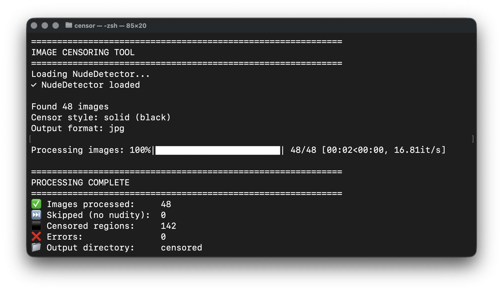

# Image Censoring Tool



A simplified Python script that automatically detects and censors nudity in images using NudeNet detector.

## Features

- **Automatic Detection**: Uses NudeNet AI model to detect exposed body parts
- **Multiple Censor Styles**:
  - Solid color bars (customizable color and opacity)
  - Gaussian blur
  - Pixelation
- **Batch Processing**: Process entire folders of images
- **Customizable**: Configure detection threshold, box sizing, and output format

## Installation

```bash
# Install dependencies
pip install -r requirements.txt
```

## Usage

### Basic Usage

```bash
# Apply black censor bars to all images
python censor.py --input images --output censored
```

### Custom Color

```bash
# Pink censor bars
python censor.py --input images --output censored --color pink

# Custom hex color
python censor.py --input images --output censored --color "#FF1493"
```

### Blur Censoring

```bash
# Apply blur instead of solid bars
python censor.py --input images --output censored --style blur --blur-radius 30
```

### Pixelated Censoring

```bash
# Apply pixelation
python censor.py --input images --output censored --style pixelate --pixel-size 20
```

### Advanced Options

```bash
# Semi-transparent bars with custom settings
python censor.py --input images --output censored \
  --color red \
  --opacity 200 \
  --threshold 0.5 \
  --box-resize -0.2 \
  --format png \
  --quality 95
```

## Command-Line Arguments

### Required

- `--input`: Input folder containing images
- `--output`: Output folder for censored images

### Censor Customization

- `--color`: Bar color (default: black)
  - Color names: black, white, red, green, blue, pink, purple, gray
  - Hex codes: #RRGGBB (e.g., #FF1493)
- `--opacity`: Transparency 0-255 (default: 255)
- `--style`: Censor type (default: solid)
  - `solid`: Colored bars
  - `blur`: Gaussian blur
  - `pixelate`: Pixelation effect
- `--blur-radius`: Blur intensity (default: 20)
- `--pixel-size`: Pixelation block size (default: 16)

### Detection Parameters

- `--threshold`: Detection confidence 0.0-1.0 (default: 0.35)
- `--box-resize`: Resize censor box (default: -0.3)
  - Negative values = smaller boxes
  - Positive values = larger boxes

### Output Settings

- `--format`: Output format: jpg, png, webp (default: jpg)
- `--quality`: Output quality 1-100 (default: 95)

## Examples

**1. Basic censoring with default black bars:**

```bash
python censor.py --input photos --output censored_photos
```

**2. Pink bars for social media:**

```bash
python censor.py --input content --output safe_content --color pink
```

**3. Heavy blur for maximum privacy:**

```bash
python censor.py --input images --output blurred --style blur --blur-radius 50
```

**4. Retro pixelation effect:**

```bash
python censor.py --input pics --output pixelated --style pixelate --pixel-size 32
```

**5. Sensitive detection (catches more):**

```bash
python censor.py --input images --output censored --threshold 0.2
```

**6. High-quality PNG output:**

```bash
python censor.py --input images --output censored --format png
```

## How It Works

1. **Detection**: Uses NudeNet's deep learning model to detect exposed body parts
2. **Classification**: Identifies specific body parts that need censoring
3. **Box Adjustment**: Applies optional resizing to censor boxes
4. **Censoring**: Applies the selected censor style (solid/blur/pixelate)
5. **Export**: Saves censored images in the specified format

## Detected Classes

The tool censors the following detected classes:

- Female breast (exposed)
- Female genitalia (exposed)
- Male genitalia (exposed)
- Anus (exposed)
- Male breast (exposed)

Images without any detected nudity are skipped.

## Performance

- **Speed**: ~1-3 seconds per image (depending on resolution)
- **Accuracy**: ~90%+ detection rate with default threshold
- **GPU Support**: Automatically uses GPU if available (CUDA)

## Troubleshooting

**"No images found"**

- Ensure input folder exists and contains supported formats (jpg, png, webp, bmp)

**"NudeDetector failed to load"**

- Run: `pip install --upgrade nudenet`
- Ensure you have internet connection for first-time model download

**Low detection rate**

- Lower `--threshold` value (e.g., 0.2 instead of 0.35)
- Check that images are clear and properly exposed

## License

This tool uses NudeNet which is licensed under GPL-3.0. Please review NudeNet's license before commercial use.

## Credits

- NudeNet: https://github.com/notAI-tech/NudeNet
- Original code: Multi-purpose dataset generator
