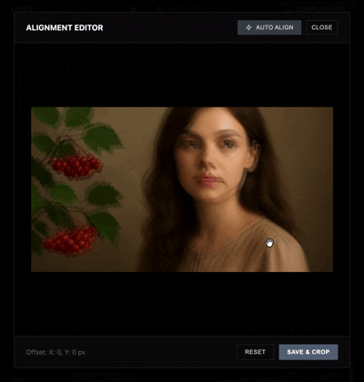

# AI Face Alignment & Comparison Tool



A professional web-based application for automated face alignment and side-by-side image comparison using AI-powered facial landmark detection.

## Features

### 🎯 Core Functionality

- **AI-Powered Face Alignment**: Automated facial alignment using MediaPipe Face Mesh technology
- **Batch Processing**: Process multiple image pairs simultaneously
- **Interactive Comparison**: Overlay images with adjustable opacity for precise comparison
- **Manual Editor**: Fine-tune alignment with drag-and-drop positioning
- **Selection Management**: Multi-select images for batch operations

### 🧠 AI Capabilities

- Face detection and landmark recognition
- Iterative refinement algorithm (5 iterations by default)
- Automatic center-of-mass calculation
- Intelligent cropping to maintain facial alignment
- WASM-based processing for performance

### 🎨 User Interface

- Modern dark theme with professional styling
- Grid-based image gallery with pagination
- Real-time hover preview for comparison
- Debug panel for monitoring (Ctrl+Shift+L)
- Toast notifications for user feedback
- Responsive design

## Technology Stack

- **Frontend**: Vanilla JavaScript (ES6+)
- **AI/ML**: MediaPipe Face Mesh
- **Styling**: CSS3 with custom properties
- **Architecture**: Modular state management

## Getting Started

### Prerequisites

- Modern web browser (Chrome, Firefox, Safari, Edge)
- Local web server for development

### Installation

1. Clone or download the project files:

```bash
git clone <repository-url>
cd <project-folder>
```

2. Serve the application using a local server:

```bash
# Using Python
python -m http.server 8000

# Using Node.js
npx serve

# Using PHP
php -S localhost:8000
```

3. Open your browser and navigate to:

```
http://localhost:8000
```

### File Structure

```
project/
├── index.html          # Main HTML structure
├── main.js             # Application logic and AI processing
├── style.css           # Styling and theme
└── js/
    └── vendor/         # MediaPipe WASM files (auto-loaded)
```

## Usage Guide

### 1. Loading Images

- Click on **"Target Folder"** to upload your primary image set
- Click on **"Control Folder"** to upload your comparison image set
- **Important**: Images must have matching filenames between folders

### 2. Viewing Images

- Images appear in a paginated grid (20 per page)
- Hover over any card to see the control image overlaid
- Use pagination controls at the bottom to navigate

### 3. Alignment Options

#### Quick Align (Single Image)

- Hover over an image card
- Click the **AI icon** button in the top-right corner
- Wait for automatic alignment (typically 2-5 seconds)
- Aligned images replace the originals in the grid

#### Batch Processing

- Select multiple images by clicking on them (checkmark appears)
- Click **"Batch Align Selected"** in the header
- Monitor progress in the batch processing modal
- Cancel anytime using the **"Cancel"** button

### 4. Manual Editing

- Click the **edit (pencil) icon** on any image card
- Drag the overlay image to adjust positioning
- Scroll to zoom in/out
- Press **Enter** to save or **Escape** to cancel

### 5. Export Options

- **Download Single**: Click the download icon on any card
- **Download Selected**: Select multiple images and use header button
- **Download All**: Use the "All Aligned" button to batch download

### 6. Management

- **Delete Image**: Click the trash icon on individual cards
- **Reset**: Return to landing page to start over

## Configuration

Edit the `CONFIG` object in `main.js` to customize:

```javascript
const CONFIG = {
  ITEMS_PER_PAGE: 20, // Images per page
  ALIGNMENT_ITERATIONS: 5, // AI refinement passes
  MAX_IMAGE_SIZE: 1280, // Max dimension for processing
  DELAY_MS: 10, // Delay between iterations
  WARMUP_IMAGE_BASE64: "...", // Pre-load image for instant first run
};
```

## Keyboard Shortcuts

| Shortcut             | Action               |
| -------------------- | -------------------- |
| `Ctrl + Shift + L`   | Toggle debug console |
| `Enter` (in editor)  | Save changes         |
| `Escape` (in editor) | Cancel editing       |

## How It Works

### Alignment Algorithm

1. **Face Detection**: MediaPipe identifies facial landmarks on both images
2. **Center Calculation**: Computes the geometric center of all detected landmarks
3. **Delta Computation**: Calculates X/Y offset between target and control faces
4. **Smart Cropping**: Crops both images to align facial centers
5. **Iterative Refinement**: Repeats process 5 times for sub-pixel accuracy

### Performance Optimization

- Images are downscaled to 1280px max before processing
- WASM acceleration for face detection
- Warm-up routine on page load prevents first-run delays
- FIFO queue system prevents concurrent AI requests

## Troubleshooting

### "No matching filenames" error

**Solution**: Ensure images in both folders have identical filenames (case-insensitive)

### Alignment fails on specific images

**Possible causes**:

- Face not clearly visible or turned away
- Multiple faces in frame
- Very low resolution
  **Solution**: Use manual editor mode for problematic images

### Slow performance

**Tips**:

- Reduce image resolution before upload
- Decrease `ALIGNMENT_ITERATIONS` in config
- Close other browser tabs
- Use Chrome or Edge for best WASM performance

### Debug console not showing

**Solution**: Press `Ctrl + Shift + L` or check browser console (F12)

## Browser Compatibility

| Browser | Minimum Version | Status             |
| ------- | --------------- | ------------------ |
| Chrome  | 90+             | ✅ Fully supported |
| Edge    | 90+             | ✅ Fully supported |
| Firefox | 88+             | ✅ Supported       |
| Safari  | 14+             | ⚠️ Limited testing |

## Limitations

- Requires frontal face visibility for optimal results
- Single-face detection only (multi-face not supported)
- Local processing only (no server upload)
- Maximum recommended image size: 4000x4000px

## Privacy & Security

- **100% Client-Side**: All processing happens in your browser
- **No Data Upload**: Images never leave your device
- **No Tracking**: No analytics or external requests
- **No Storage**: No cookies or local storage used

## Technical Details

### MediaPipe Integration

- Model: Face Mesh (Lite)
- Landmarks: 468 facial points
- Detection threshold: 0.2 (lenient for varied conditions)
- Single face mode enabled

### Image Processing

- Output format: JPEG
- Coordinate system: Top-left origin
- Transform: Translate + Scale
- Export: Blob-based downloads
